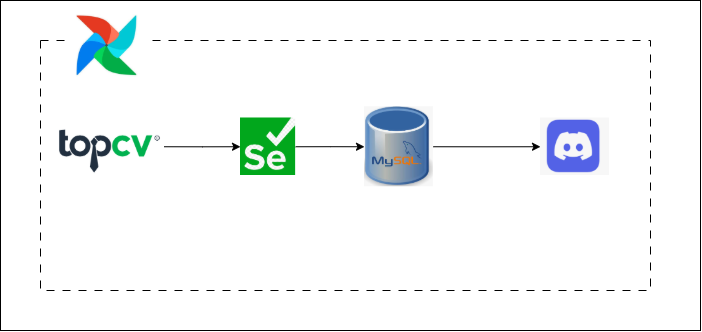
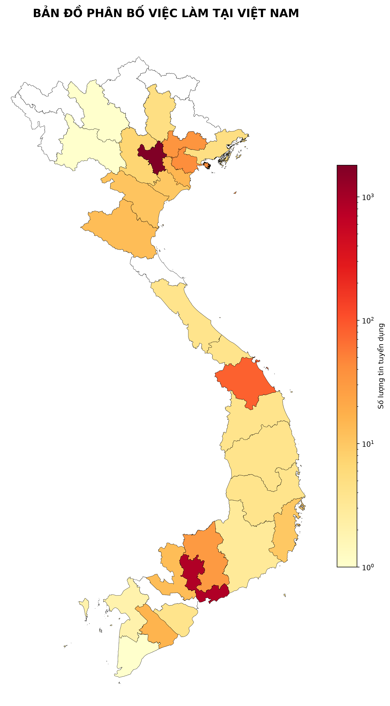
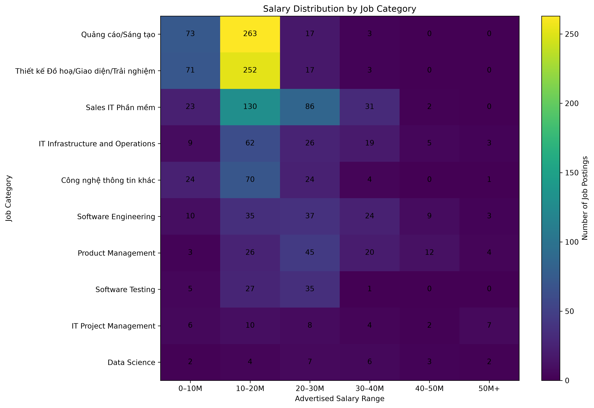
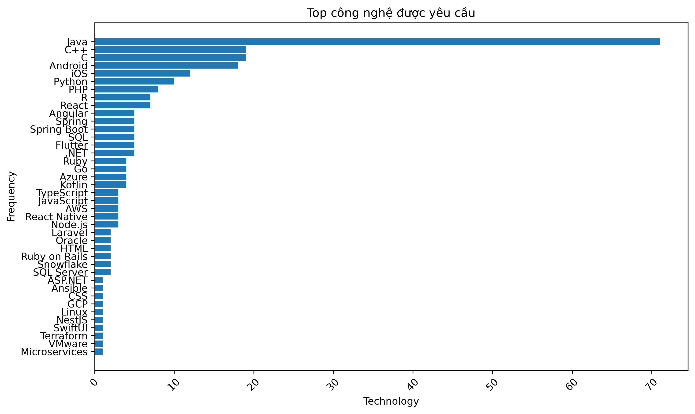
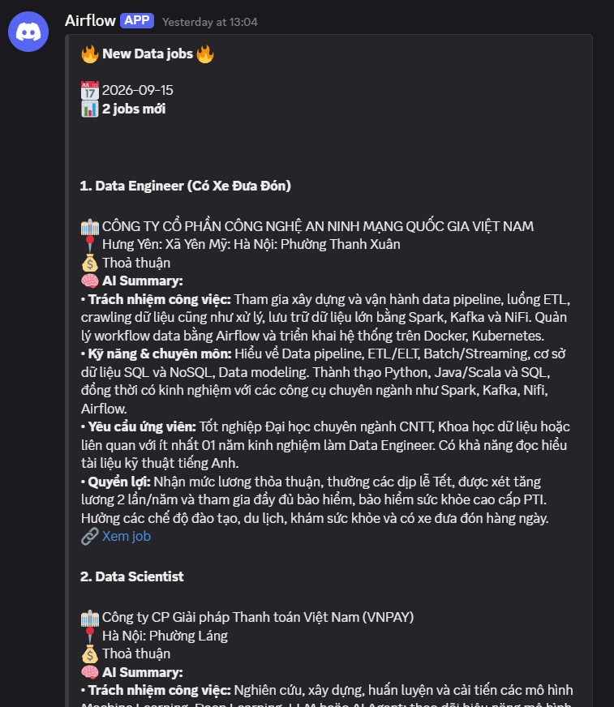

# IT Jobs Market Analysis

A Data Engineering project for crawling and analyzing IT job market data from TopCV.

## Architecture



```text
TopCV
  ↓
Selenium Crawler
  ↓
MySQL
  ↓
Data Processing
  ├── Salary Parsing
  ├── Location Normalization
  ├── Job Classification
  └── Technology Extraction
  ↓
Analytics & Visualization
  └── Salary / Technology / Location
```

## Tech Stack

* **Python**
* **Selenium** — Web Crawling
* **MySQL** — Data Storage
* **Pandas** — Data Processing
* **Gemini API** — Data Enrichment
* **Apache Airflow** — Workflow Orchestration
* **Matplotlib** — Visualization
* **OpenPyXL** — Excel Reports
* **Discord Webhook** — Job Notifications
* **Docker** — Containerization

## Features

* Crawl IT jobs from TopCV
* Clean and normalize salary & location data
* Classify jobs into IT categories
* Extract and analyze technologies
* Generate salary, technology and geographic visualizations
* Automatically collect and notify newly posted **Data Engineer** jobs via Discord
* Orchestrate pipelines with Airflow
* Automatically collect and notify newly posted IT jobs via Discord
* Generate AI summaries for job postings
* Export Data Engineer jobs to Excel

## Charts

### Job Distribution by Location



### Salary Distribution



### Top Technologies



## Job Notifications

The pipeline automatically detects newly posted IT jobs and sends notifications to Discord.



The notification includes:

- Posting date
- Number of new jobs
- Job title
- Company
- Location
- Salary
- AI-generated job summary
- Link to the job
## Project Structure

```text
it-jobs-market-analysis/
├── crawler/
├── processing/
├── analytics/
├── dags/
├── tests/
├── docs/
│   └── architecture.png
├── docker-compose.yml
└── README.md
```

## Run

```bash
git clone https://github.com/Loi-ND/it-jobs-market-analysis.git
cd it-jobs-market-analysis
pip install -r requirements.txt
```
